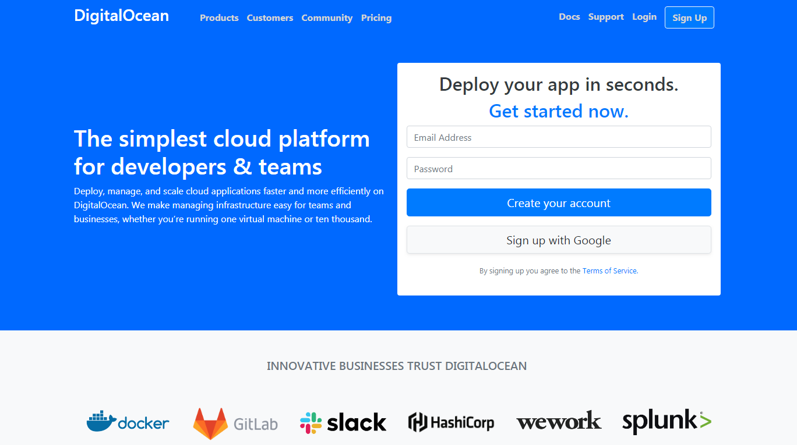

# DigitalOcean Clone

Questo clone è stato realizzato integralmente utilizzando __Bootstrap__ sfruttando al massimo tutte le sue potenzialità col fine di scrivere meno CSS possibile... risultato? Una fedele riproduzione con sole __55__ righe di CSS!   

* __Sito Originale:__ [DigitalOcean](https://www.digitalocean.com/) (Del Febbraio 2019)
* __Linguaggi:__ HTML/CSS(Bootstrap)
* __Responsive:__ Si
___

## Preview

___

